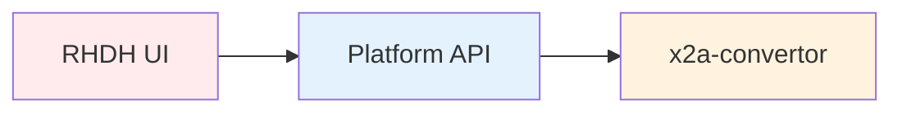
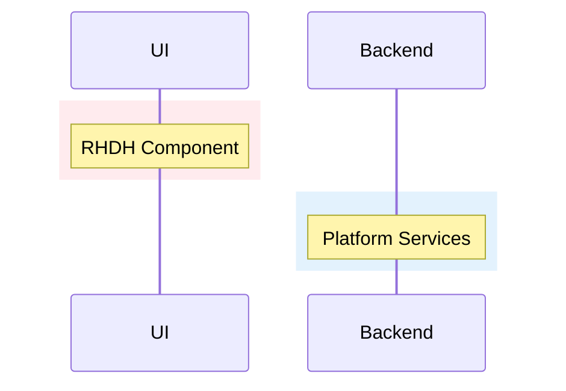

# CLAUDE.md

This file provides guidance to Claude Code (claude.ai/code) when working with code in this repository.

## What is X2Ansible?

X2Ansible is a migration platform that converts Chef, Puppet, and PowerShell infrastructure code into Ansible. It combines:

- **Web Platform**: Built on Red Hat Developer Hub (Backstage) for project management, tracking, and review
- **Migration Engine**: The x2a-convertor, a multi-agent LangGraph application that performs analysis and code generation
- **Four-Phase Workflow**: Init → Analyze → Migrate → Publish, with human review checkpoints between each phase
- **Dual Deployment**: Runs as a Kubernetes platform or standalone CLI tool

### Architecture

The platform orchestrates Kubernetes jobs running the x2a-convertor engine. Users interact through the web UI to create migration projects and review phase outputs. The convertor connects to LLM providers (AWS Bedrock, OpenAI, Vertex AI, or local Ollama), parses source code using technology-specific agents, and generates validated Ansible roles. Converted code is pushed to Git and optionally synced to Ansible Automation Platform.

## Repository Structure

This repository (`x2ansible.github.io`) hosts the X2Ansible documentation site and deployment manifests. The actual convertor engine code lives in a separate repository ([x2a-convertor](https://github.com/x2ansible/x2a-convertor)).

```
.
├── docs/                      # Jekyll documentation site
│   ├── latest/               # Current documentation (the working tree)
│   ├── v0.5/                 # Frozen documentation for release 0.5
│   ├── versions.md           # Version index
│   └── developing/           # Release procedures (inside latest/)
├── deploy/                   # Current OpenShift deployment manifests
│   ├── app.yaml              # Backstage CR and ConfigMaps
│   ├── operator.yaml         # RHDH operator
│   ├── secrets.yaml.template # Credential template
│   └── v0.5/                 # Frozen deployment manifests for release 0.5
└── shell.nix                # Playwright environment for screenshots
```

## Documentation Development

### Building and Serving the Docs

The docs are built with Jekyll and served locally using Podman:

```bash
# Serve with live reload (from docs/ directory)
cd docs
make serve

# Build static site
make build

# Check links
make check-links
```

The site runs at `http://localhost:4000`.

### Automated Documentation Sync

The `.github/workflows/x2a-convertor-sync.yaml` workflow automatically syncs generated documentation from the [x2a-convertor](https://github.com/x2ansible/x2a-convertor) repository:

1. Checks out both repositories
2. Installs dependencies and runs `make generate-docs` in x2a-convertor
3. Copies generated docs (CLI reference, configuration options, getting-started guides)
4. Creates a PR with the changes to this repository

The workflow is manually triggered via `workflow_dispatch`. When the PR is merged, the documentation site is automatically updated.

### Diagram Standards

### When to Use Each Diagram Type

Choose the right Mermaid diagram type based on what you're showing:

| Diagram Type | When to Use | Examples |
|--------------|-------------|----------|
| `architecture-beta` | System architecture, platform components, service topology | Overall platform architecture, integration points |
| `flowchart` | Process flows with decision points, loops, or non-linear paths | Migration phase workflow with retry logic, conditional routing |
| `sequenceDiagram` | Time-ordered interactions between actors/systems | Job execution flow, API request/response sequences |
| `stateDiagram-v2` | State transitions, agent workflows, phase progressions | Chef agent stages, PowerShell analysis workflow |
| `gantt` | Timelines, parallel execution, schedules | Module migration parallelization |

**Default choice**: Use the simplest diagram type that clearly shows the concept. Don't force `architecture-beta` for sequential processes.

### Color Coding Standards

Apply consistent colors to represent system components:

```mermaid
# Color Palette
Red Hat Developer Hub / RHDH UI:     #e53935 or fill:#ffebee (light red)
OpenShift / Kubernetes / Platform:   #0066cc or fill:#e3f2fd (light blue)
X2A Convertor / Migration Engine:    #ff9800 or fill:#fff3e0 (light orange)
AI / LLM Services:                   #e3f2fd (light blue)
Data / Output:                       #e8f5e9 (light green)
External Services (Git, AAP):        #f3e5f5 (light purple)
```

**Applying colors**:

For `flowchart` diagrams:


For `sequenceDiagram`:


### Architecture-Beta Constraints

When using `architecture-beta`:

- **Port constraint**: Each port (`R`, `L`, `T`, `B`) can only have **ONE outgoing edge**
- **Icon types**: `cloud`, `server`, `database`, `internet`, `disk`
- **Layout pattern**: Left-to-right for main flow, use vertical (`B --> T`) for fan-out/routing
- **Fixing port collisions**: If a node needs to connect to multiple targets, use vertical fan-out instead of horizontal

**Bad** (port collision):
```mermaid
router:R --> L:agent1
router:R --> L:agent2  # ERROR: R port already used
```

**Good** (vertical fan-out):
```mermaid
router:B --> T:agent1
router:B --> T:agent2  # OK: Different edge instances
```

### Diagram Layout Patterns

**Platform Architecture** (left-to-right flow):
- Users/Input (left) → Platform (center-left) → Engine (center-right) → External/Output (right)
- Vertical edges for databases/dependencies

**Phase Workflows** (prefer flowchart for clarity):
- Linear: `flowchart LR`
- With decision points: `flowchart TB` with diamond decision nodes
- Show retry loops with labeled back-edges

**Agent Internals** (state machines):
- Use `stateDiagram-v2` for stage-by-stage progression
- Add notes to explain what happens in each state

See `docs/latest/index.md` for the platform architecture example and `docs/latest/phases/migrate.md` for a process flowchart with retry logic.

### Documentation versions

Documentation is published under a version prefix. `docs/latest/` and the root `deploy/` directory describe the current release. Released versions (for example `docs/v0.5/` and `deploy/v0.5/`) are frozen snapshots and **must not be modified** after release. Do not update, fix, or otherwise touch a frozen version when current behavior changes; make those changes only in `latest/` and the live `deploy/` directory, then create a new version snapshot when releasing.

To add a release, follow the checklist in [`docs/latest/developing/versioning.md`](docs/latest/developing/versioning.md). In short:

1. Update and test `docs/latest/` and `deploy/` for the new release.
2. Copy both trees to `docs/v<version>/` and `deploy/v<version>/` (excluding any real secrets).
3. Add a `docs/_includes/deploy-v<version>` symlink to the versioned deployment directory.
4. Change copied deployment instructions to use `deploy/v<version>/` and the matching include symlink.
5. Add the release to `docs/versions.md`, build, and check links.

Never let a frozen version reference the live `deploy/` directory: deployment manifests change independently from documentation.

## Generating Diagram Screenshots

When Mermaid diagrams need to be captured as images:

1. **Start the Jekyll server** (diagrams must render in the browser):
   ```bash
   cd docs
   make serve
   ```

2. **Run the Playwright screenshot script**:
   ```bash

   playwright screenshot http://localhost:4000/ /tmp/output.png
   ```

3. **Screenshots saved to** `/tmp/output.png`

## Key Technologies

- **Jekyll 4.4.1**: Documentation static site generator
- **Mermaid 11.4.1+**: Diagram rendering (architecture-beta syntax)
- **Playwright**: Browser automation for diagram screenshots
- **Backstage/RHDH**: Web UI platform
- **OpenShift/Kubernetes**: Deployment target
- **Nix**: Playwright environment management
