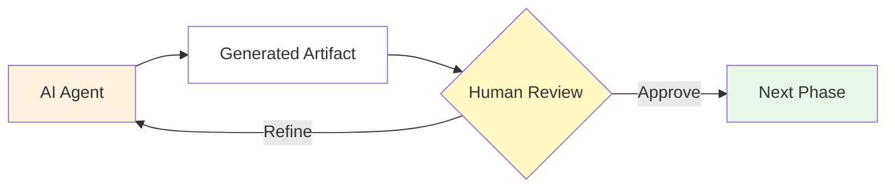

# Human Checkpoints

Every migration phase pauses for human review before proceeding. This prevents AI-generated errors from compounding across phases and gives teams control over architectural decisions, business logic validation, and compliance requirements.

## Checkpoint 1: Init Plan Review

**After**: Init phase completes
**Artifact**: `migration-plan.md`

Review that:
- All expected modules are identified
- Dependency relationships are accurate
- Migration priority order aligns with deployment architecture
- External dependencies are noted
- Complexity estimates are reasonable

**Actions**: Approve and proceed, adjust requirements and re-run, or exclude specific modules.

## Checkpoint 2: Module Specification Review

**After**: Analyze phase completes for a module
**Artifact**: `migration-plan-<module>.md`

Review that:
- All source files are mapped to target files
- Template variable conversions are correct
- Resource mappings preserve original logic
- Secrets and sensitive data are flagged

**Actions**: Approve and proceed, re-run with clarifications, or edit the specification directly.

## Checkpoint 3: Generated Code Review

**After**: Migrate phase completes
**Artifact**: `ansible/roles/<module>/` directory

Review that:
- Role follows Ansible best practices
- Task order matches source execution logic
- Templates are correctly converted to Jinja2
- Variables match expected defaults
- No ansible-lint errors remain
- Idempotency is maintained
- Collection dependencies are correct (if AAP is enabled)

**Actions**: Approve and proceed to publish, re-run with adjustments, or apply manual fixes.

### AAP Collection Discovery

When AAP integration is configured, the Migrate phase searches your Private Automation Hub for reusable collections. Discovered collections appear in `requirements.yml`. Review that:
- Collections match expected functionality
- Versions are appropriate
- Generated tasks use collections correctly

## Checkpoint 4: Published Deployment Review

**After**: Publish phase completes
**Artifact**: Project directory and AAP Project (if configured)

Review that:
- Project structure follows Ansible conventions
- Playbooks reference correct roles
- Collection requirements are complete
- AAP Project syncs successfully (if applicable)

**Actions**: Approve for production, re-run publish-project, or adjust configuration.
