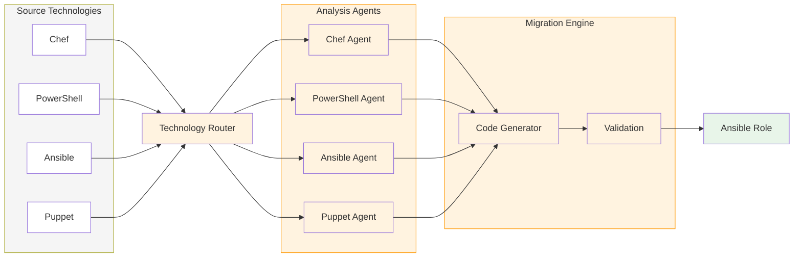

# The Migration Engine

The x2a-convertor is the component that performs infrastructure code analysis and Ansible generation. Within the platform, it runs as a container inside Kubernetes jobs. It can also run standalone as a CLI tool.

## How It Works

The engine uses a multi-agent architecture built on LangGraph. Each migration phase runs a different set of agents, and each agent has access to specialized tools for parsing, analyzing, and generating code.

The engine detects the source technology automatically and routes to the appropriate analysis agent. Each agent understands the conventions of its source language: the Chef agent uses Tree-sitter for Ruby parsing and resolves Supermarket dependencies, the PowerShell agent handles DSC configurations and script modules, and the Ansible agent modernizes legacy roles across 21 categories.

## Supported Technologies

| Source | Status | What Gets Analyzed |
|--------|--------|--------------------|
| Chef | Full support | Cookbooks, recipes, templates, attributes, Supermarket dependencies |
| PowerShell | Full support | Scripts, modules, DSC configurations |
| Ansible | Full support | Legacy roles (modernization to current best practices) |
| Puppet | Full support | Manifests, modules, Hiera data |
| Salt | Basic support | State files |

## LLM Providers

The engine supports multiple LLM backends. The choice of provider does not affect the migration workflow, only the underlying model used for analysis and generation.

| Provider | Configuration | Use Case |
|----------|---------------|----------|
| AWS Bedrock | `AWS_BEARER_TOKEN_BEDROCK` | Enterprise environments with AWS infrastructure |
| OpenAI | `OPENAI_API_KEY` | Development, testing, OpenAI-compatible endpoints |
| Google Vertex AI | `GOOGLE_APPLICATION_CREDENTIALS` | GCP environments |
| Local models (Ollama, vLLM) | `OPENAI_API_BASE` | Air-gapped networks, on-premise deployments |

## Validation

Generated Ansible code goes through automated validation using ansible-lint. The engine retries up to 5 times, using the LLM to fix lint errors between attempts. This loop runs before any human review, so the output that reaches reviewers has already passed basic quality checks.

## Platform Integration

When running inside the platform, the engine receives its configuration through Kubernetes secrets (LLM credentials, Git tokens, AAP credentials). It reports results back to the platform through a webhook callback with HMAC signature verification. The platform stores artifacts, telemetry, and migration plans in its database and updates the project status in the UI.

When running standalone, the engine reads configuration from environment variables or a `.env` file and writes output directly to the filesystem.
