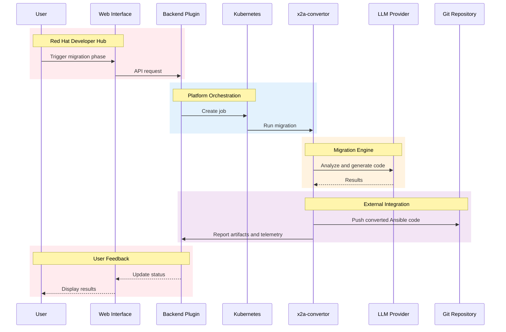

# Concepts

X2Ansible is built from three main components that work together as a platform.

## The Platform

The web interface runs on Red Hat Developer Hub (or vanilla Backstage). It provides project management, user authentication, role-based access control, and a REST API. Teams create migration projects through the browser, connect their source and target Git repositories, and track progress across modules.

When a user triggers a migration phase, the backend creates a Kubernetes job. That job runs the x2a-convertor container, which performs the actual analysis and code generation using LLM providers. Results are reported back to the platform, stored in the database, and pushed to the target Git repository.

## Topics

### [The Migration Engine]()
How x2a-convertor analyzes source code and generates Ansible output.

### [Migration Phases]()
The four-phase workflow: Init, Analyze, Migrate, and Publish.
