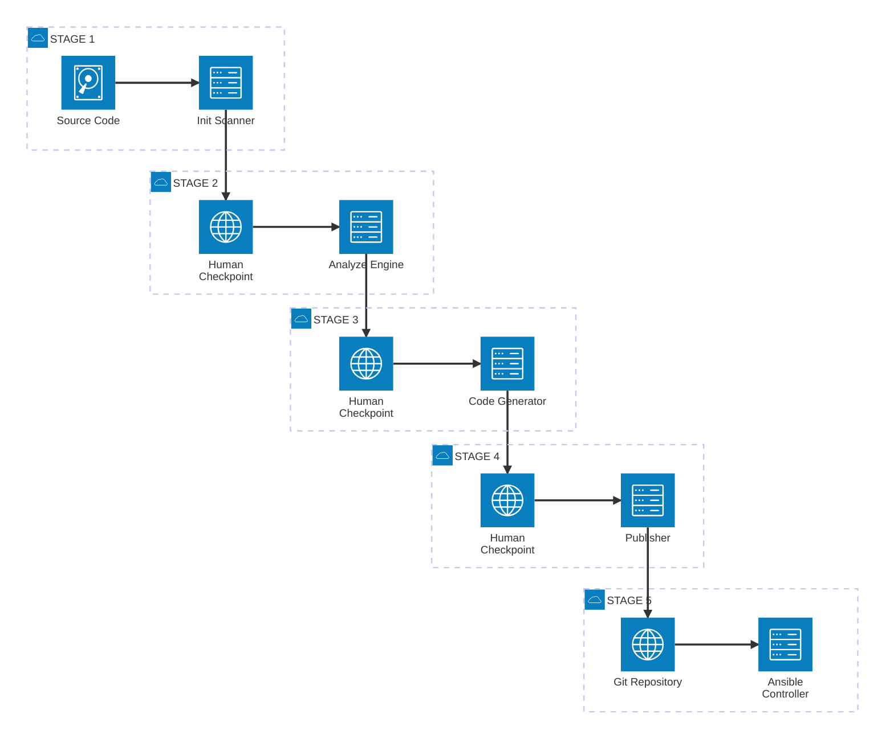

# Migration Phases

Every migration follows four phases. Each phase produces artifacts that are reviewed before the next phase begins. This structure prevents errors from compounding and gives teams control over every step.





## Phase 1: Init

Scans the entire source repository to identify modules, map dependencies, and produce a strategic migration plan. The output is a `migration-plan.md` that lists all discovered modules with their complexity and recommended migration order.

This phase runs once per repository.

[Detailed Init documentation]()

## Phase 2: Analyze

Takes a single module from the migration plan and produces a detailed specification. The analysis agent parses the source code, extracts resource mappings, variable translations, and template conversions. The output is a `migration-plan-<module>.md` with file-by-file migration instructions.

This phase runs once per module.

[Detailed Analyze documentation]()

## Phase 3: Migrate

Reads the migration plan and module specification, then generates a complete Ansible role. The engine converts templates, maps resources to Ansible modules, generates handlers, and validates the output with ansible-lint. Failed lint checks trigger automatic fixes (up to 5 attempts).

The output is a complete Ansible role directory with tasks, templates, defaults, handlers, and metadata.

[Detailed Migrate documentation]()

## Phase 4: Publish

Packages the migrated role into an Ansible project structure (ansible.cfg, collections, inventory, playbooks) and optionally syncs it to Ansible Automation Platform. The first module creates the project skeleton; subsequent modules append their roles and playbooks.

[Detailed Publish documentation]()

## Parallel Execution

Independent modules can run through Analyze, Migrate, and Publish in parallel. Only the Init phase (which scans the full repository) must run first.

```mermaid
gantt
    title Parallel Migration (3 Modules)
    dateFormat X
    axisFormat %M min

    section Init
    Repository scan      :0, 5

    section Module A
    Analyze A      :5, 15
    Migrate A      :15, 30
    Publish A      :30, 35

    section Module B
    Analyze B      :5, 15
    Migrate B      :15, 30
    Publish B      :30, 35

    section Module C
    Analyze C      :5, 15
    Migrate C      :15, 30
    Publish C      :30, 35
```

