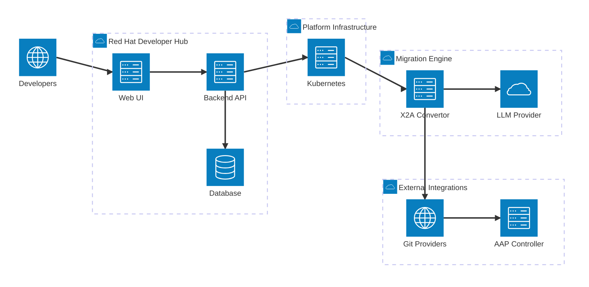

# X2Ansible

X2Ansible is a migration platform that converts Chef, Puppet, and PowerShell infrastructure code into Ansible. It combines a web interface built on Red Hat Developer Hub (Backstage) with an AI migration engine, giving teams a managed way to plan, execute, and track large-scale migrations.

## Platform Architecture

Users interact through the web interface to create migration projects, trigger migration phases, and review results. The backend orchestrates Kubernetes jobs that run the x2a-convertor engine. Converted Ansible code is pushed to Git repositories and optionally synced to Ansible Automation Platform.

The x2a-convertor can also run standalone as a CLI for teams that prefer direct command-line workflows.

## Key Features

- **Web-based project management**: Create, track, and manage migration projects through a browser. Support for CSV bulk import of projects.
- **Four-phase migration workflow**: Init, Analyze, Migrate, and Publish. Each phase produces reviewable artifacts before proceeding.
- **Human review checkpoints**: Nothing reaches production without explicit approval. Every phase pauses for human review.
- **Role-based access control**: Three permission tiers (user, admin-read, admin-write) with OAuth authentication through GitHub, GitLab, or Bitbucket.
- **MCP tools integration**: Connect AI assistants (Cursor, Claude Desktop) to X2Ansible through the Model Context Protocol.
- **Telemetry and cost tracking**: Per-phase metrics on duration, token usage, and tool calls for visibility into migration costs.
- **Multiple LLM providers**: AWS Bedrock, OpenAI, Google Vertex AI, or local models (Ollama) for air-gapped environments.
- **AAP integration**: Automatic collection discovery from Private Automation Hub and project sync to AAP Controller.

## Requirements

| Component | Purpose |
|-----------|---------|
| Kubernetes or OpenShift | Runs the platform and migration jobs |
| Red Hat Developer Hub or Backstage | Provides the web interface |
| LLM provider | Powers the AI migration engine (AWS Bedrock, OpenAI, or local) |
| Git provider | Source and target repositories (GitHub, GitLab, Bitbucket) |
| Ansible Automation Platform | Optional. For collection discovery and deployment |

## Where to Start

### Evaluating X2Ansible

Read [Concepts](concepts/) to understand the platform, the migration engine, and the four-phase workflow.

### Deploying the Platform

See [X2Ansible Platform](platform/) for installation on Kubernetes/OpenShift, authentication setup, and RBAC configuration.

### Using the CLI Standalone

See [X2A Convertor Reference](convertor-reference/) for CLI installation, configuration, and usage without the web platform.

### Understanding Migration Phases

See [Phases](phases/) for detailed documentation on each migration phase: Init, Analyze, Migrate, and Publish.
