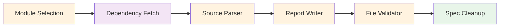

# Analyze Phase

Produces a detailed migration specification for a single module.

## What Happens

1. Selects the target module from the migration plan
2. Fetches external dependencies (e.g., Chef Supermarket cookbooks via `berks`)
3. Parses source code using technology-specific tools (Tree-sitter for Ruby, LLM for PowerShell/Ansible)
4. Maps source resources to Ansible equivalents
5. Extracts variable translations and template conversions
6. Validates completeness of the analysis
7. Cleans up and finalizes the specification



## Output

**File**: `migration-plan-<module-name>.md`

Contains:
- Module-specific overview
- File-by-file mapping (source file to target Ansible file)
- Resource translation table (e.g., Chef `package` to Ansible `ansible.builtin.package`)
- Variable mapping (e.g., Chef attributes to Ansible defaults)
- Template conversion notes (ERB to Jinja2)
- Handler and notification mappings

## CLI Usage

```bash
uv run app.py analyze --source-dir ./chef-repo "Analyze nginx-multisite cookbook"
```

## Review Checklist

Before proceeding to Migrate:

- All source files are mapped to target files
- Template variable conversions are correct
- Resource mappings preserve the original logic
- Dependencies are properly handled
- Edge cases and complex conversions are flagged

## Re-running Analyze

Edit the migration plan manually if mappings need correction, or re-run with additional context:

```bash
uv run app.py analyze --source-dir ./chef-repo "Focus on SSL configuration details in nginx"
```
