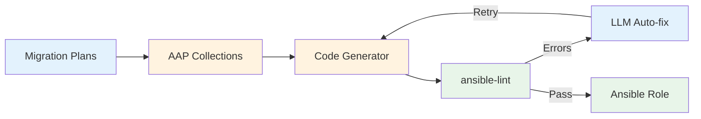

# Migrate Phase

Generates a complete Ansible role from the migration specification.

## What Happens

1. Reads the high-level migration plan and module specification
2. Discovers reusable collections from Private Automation Hub (if AAP is configured)
3. Plans the migration tasks based on the specification
4. Generates Ansible files: tasks, defaults, templates, handlers, metadata
5. Converts templates from source format (ERB, DSC) to Jinja2
6. Runs ansible-lint validation
7. Automatically fixes lint errors (up to 5 attempts)







## Output

**Directory**: `ansible/roles/<role_name>/`

Role names are sanitized: hyphens become underscores, names are lowercased.

```
ansible/roles/nginx_multisite/
├── defaults/main.yml
├── files/
├── handlers/main.yml
├── tasks/main.yml
├── templates/nginx.conf.j2
├── meta/main.yml
└── molecule/default/
```

Additional files:
- `requirements.yml` with collection dependencies
- `export-output.md` with migration report

## AAP Collection Discovery

When `AAP_CONTROLLER_URL` and `AAP_OAUTH_TOKEN` are configured, the migrate phase queries your Private Automation Hub for reusable collections. Found collections are added to `requirements.yml` and used in generated tasks. This step is skipped if AAP is not configured.

## CLI Usage

```bash
uv run app.py migrate \
  --source-dir ./chef-repo \
  --source-technology Chef \
  --high-level-migration-plan migration-plan.md \
  --module-migration-plan migration-plan-nginx-multisite.md \
  "Convert nginx-multisite cookbook"
```

## Review Checklist

Before proceeding to Publish:

- Task order preserves the original execution logic
- Templates are correctly converted to Jinja2
- Variables match expected defaults
- Handlers are triggered appropriately
- No ansible-lint errors remain
- Idempotency is maintained
- Collection dependencies in `requirements.yml` are correct (if AAP is enabled)

## Testing Before Production

```bash
ansible-playbook --syntax-check site.yml
ansible-playbook --check site.yml
ansible-playbook -i test-inventory site.yml
```
