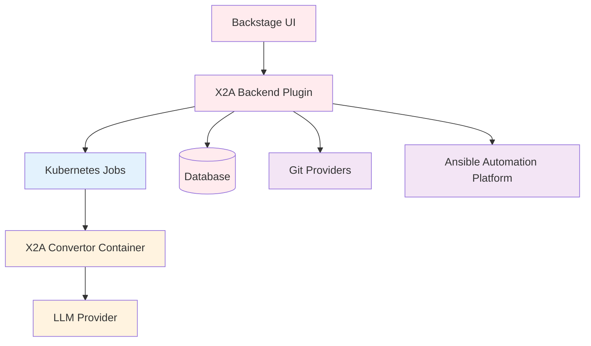
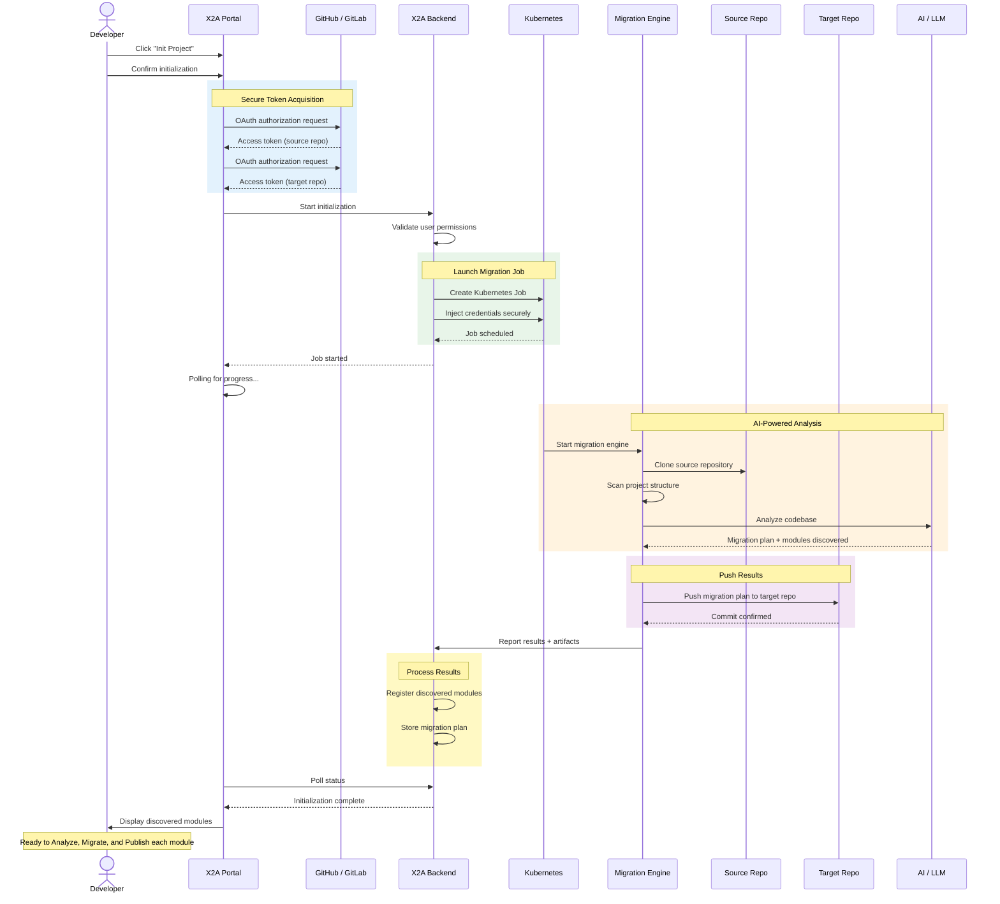

# X2Ansible Platform

The X2Ansible Backstage Plugin provides a web-based user interface for managing migration projects, running conversion jobs, and integrating with Ansible Automation Platform.

## Overview

The UI is built as a Backstage plugin workspace, providing:

- **Project Management**: Create, view, edit and manage migration projects
- **Job Orchestration**: Run and monitor migration jobs via Kubernetes
- **Source Control Integration**: Connect to GitHub, GitLab, and Bitbucket repositories
- **Ansible Automation Platform**: Deploy migrated playbooks to AAP

## Documentation Sections

### [Installation]()
Deployment guide for OpenShift and Kubernetes environments.

### [Installation (vanilla Backstage)]()
Add published `@red-hat-developer-hub/*` X2A packages to a freshly generated `create-app` Backstage instance.

### [Authentication]()
OAuth setup, providers, and user management.

### [Authorization]()
RBAC permissions and access control policies.

### [MCP tools]()
Connect assistants to Conversion Hub via RBAC-aware MCP tools.

### [CSV Bulk Import]()
Create multiple conversion projects at once by uploading a CSV file.

### [API Reference]()
Swagger UI for exploring the OpenAPI specification.

## Quick Links

- **Backend Plugin**: RESTful API and Kubernetes job orchestration (see ooo/x2a/plugins/x2a-backend/)
- **Source Repository**: [X2Ansible Convertor](https://github.com/x2ansible/x2a-convertor)

## Architecture

The UI communicates with the backend plugin via REST API. The backend orchestrates Kubernetes jobs that run the X2A convertor container, which uses LLM providers to perform the actual migration analysis and code generation.

## Job Execution Flow

The following diagram illustrates how a Job runs on each phase. When a user triggers any phase (Init, Analyze, Migrate, or Publish), this is the sequence of operations that the system executes end-to-end.




